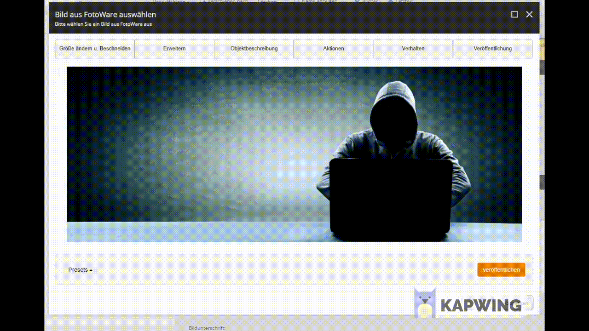
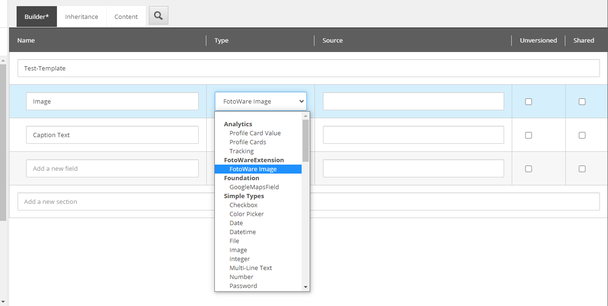
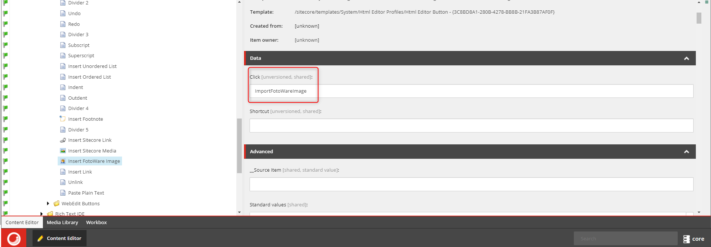

# Sitecore-FotoWare-Extension
## Description
With this module you can import images managed in FotoWare DAM directly into your Sitecore media library.

## Features
+ Select and import single image along with related meta-data 
+ Edit image (Crop, Resize, Add Filters) with FotoWare-Tools before importing
+ Synchronize imported data with FotoWare

## Supported Sitecore Field-Types
+ Image
+ RichText

## Demo


## Requirements
+ Sitecore 9.1 (might work for other versions, was programmed against Sitecore 9.1 Initial Release)
+ Sitecore Powershell Extensions (https://doc.sitecorepowershell.com/)
+ FotoWare with "Non-interactive" authorization (__[more Informations here](https://learn.fotoware.com/Integrations_and_APIs/Authorizing_applications_using_OAuth/03_Authorizing_a_client_using_OAuth_2.0/Non-interactive_application_authorization_with_OAuth_2.0)__)

## Installation Guide
### 1. Download package and install
First you have to Download __[the package here](https://github.com/Kingmaddi/Sitecore-FotoWare-Extension-DEV/releases/tag/1.0)__ and install it with the Sitecore installation wizard. Please notice, that the package is only tested with Sitecore 9.1.*.
### 2. Set following configurations in Sitecore and replace with your data:
```
<setting name="Foundation.FotoWareExtensions.FotoWare.TenantUrl" value="YOUR_FOTOWARE_BASE_URL" />
```
```
<setting name="Foundation.FotoWareExtensions.FotoWare.ClientId" value="YOUR_FOTOWARE_NON_INTERACTIVE_CLIENT_ID" />
```
```
<setting name="Foundation.FotoWareExtensions.FotoWare.ClientSecret" value="YOUR_FOTOWARE_NON_INTERACTIVE_CLIENT_SECRET" />
```
#### Optional configurations:
Set content leanguage (default de-DE):
```
<setting name="Foundation.FotoWareExtensions.Language" value="YOUR_LANGUAGE" />
```

Set path for import (default /sitecore/media library/FotoWare):
```
<setting name="Foundation.FotoWareExtensions.TargetPath" value="YOUR_PATH" />
```

### 3. Setup Image-Field
Go to all templates where you want to use the FotoWare-Import. Then change the type from "Image" to "FotoWare Image" (see Screenshot).



### 4. Setup RichText-Field
1. Go to Core-Database and open Content Editor.
2. Go to /sitecore/system/Settings/Html Editor Profiles
3. Select your profile for example "Rich Text default" and expand it.
4. Select "Toolbar 1" and expand it.
5. Search for "Insert Sitecore Media" and duplicate it. 
6. Change "InsertSitecoreMedia" in field "Click" to "ImportFotoWareImage".
7. Optional you can change the Icon and Displayname for a better experience.



## Contributers
+ Mattheo Brajko
